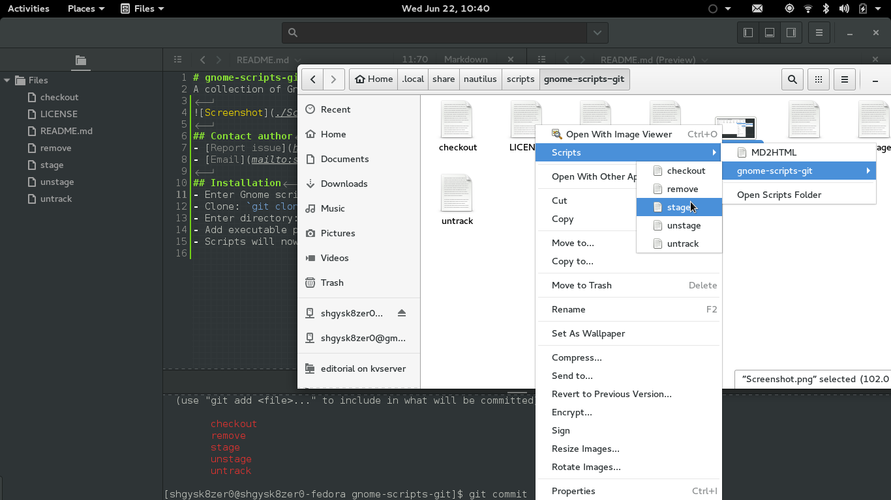

# gnome-scripts-git
A collection of Gnome Scripts for Git. **Linux only**

## Contact author
- [Report issue](https://github.com/shgysk8zer0/gnome-scripts-git/issues/new)
- [Email](mailto:shgysk8zer0@gmail.com?subject=gnome-scripts-git)

## Installation
- Enter Gnome scripts directory: `cd ~/.local/share/nautilus/scripts/`
- Clone: `git clone git://github.com/shgysk8zer0/gnome-scripts-git.git git`
- Enter directory: `cd git`
- Add executable permissions to scripts: `chmod u+x $script`
- Scripts will now be added to context-menus when right-clicking on files

## Available commands
- checkout
- stage
- unstage
- remove
- untrack
